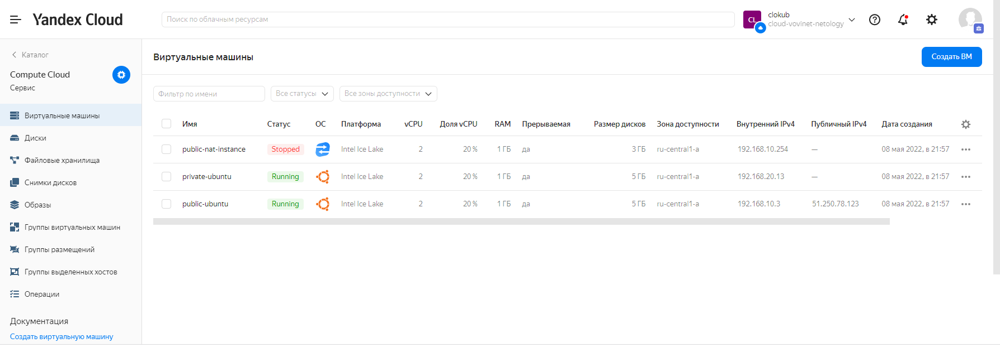

# 15.1. Организация сети

## 1. Яндекс.Облако

Подготовка:
- настройка terraform на зеркало Yandex.Cloud
- настройка провайдера, используя локальный бекенд
- настройка сервисного аккаунта с файлом-ключом через переменную окружения.

Получившиеся манифесты находятся в каталоге [15.1/terraform/](15.1/terraform/)

### Инициализирую terraform  
```
$ terraform init

Initializing the backend...

Initializing provider plugins...
- Finding latest version of terraform-registry.storage.yandexcloud.net/yandex-cloud/yandex...
- Installing terraform-registry.storage.yandexcloud.net/yandex-cloud/yandex v0.72.0...
- Installed terraform-registry.storage.yandexcloud.net/yandex-cloud/yandex v0.72.0 (self-signed, key ID E40F590B50BB8E40)

Partner and community providers are signed by their developers.
If you'd like to know more about provider signing, you can read about it here:
https://www.terraform.io/docs/cli/plugins/signing.html

Terraform has created a lock file .terraform.lock.hcl to record the provider
selections it made above. Include this file in your version control repository
so that Terraform can guarantee to make the same selections by default when
you run "terraform init" in the future.

Terraform has been successfully initialized!

You may now begin working with Terraform. Try running "terraform plan" to see
any changes that are required for your infrastructure. All Terraform commands
should now work.

If you ever set or change modules or backend configuration for Terraform,
rerun this command to reinitialize your working directory. If you forget, other
commands will detect it and remind you to do so if necessary.
```

### Прмиеняю:
```
$ terraform apply
...
yandex_vpc_network.net-15-1: Creating...
yandex_vpc_network.net-15-1: Creation complete after 1s [id=enphmpm2p5qpcophfrb4]
yandex_vpc_route_table.rt-private: Creating...
yandex_vpc_subnet.public: Creating...
yandex_vpc_route_table.rt-private: Creation complete after 1s [id=enpta2avd06rgaottbaq]
yandex_vpc_subnet.private: Creating...
yandex_vpc_subnet.public: Creation complete after 2s [id=e9bdb30bliinl1pi0700]
yandex_compute_instance.public-ubuntu: Creating...
yandex_compute_instance.public-nat-instance: Creating...
yandex_vpc_subnet.private: Creation complete after 1s [id=e9bnjjs2r0i90fmi3quc]
yandex_compute_instance.private-ubuntu: Creating...
yandex_compute_instance.public-ubuntu: Still creating... [10s elapsed]
yandex_compute_instance.public-nat-instance: Still creating... [10s elapsed]
yandex_compute_instance.private-ubuntu: Still creating... [10s elapsed]
yandex_compute_instance.public-nat-instance: Still creating... [20s elapsed]
yandex_compute_instance.public-ubuntu: Still creating... [20s elapsed]
yandex_compute_instance.private-ubuntu: Still creating... [20s elapsed]
yandex_compute_instance.public-ubuntu: Creation complete after 22s [id=fhmsajjsjgeulsv8bojl]
yandex_compute_instance.private-ubuntu: Creation complete after 23s [id=fhmeilijjk10p6t58eu5]
yandex_compute_instance.public-nat-instance: Still creating... [30s elapsed]
yandex_compute_instance.public-nat-instance: Still creating... [40s elapsed]
yandex_compute_instance.public-nat-instance: Creation complete after 43s [id=fhmcab63co1iu2ekdjtk]

Apply complete! Resources: 7 added, 0 changed, 0 destroyed.
```

## Проверка:

1. Смотрим через веб-интерфейс, что у нас получилось:  


2. Пройдём на public-ubuntu, поместим на неё закрытый ssh-ключ для того, чтобы с неё перейти на private-ubuntu:


3. Заходим на private-ubuntu, проверяем доступность интернета:


4. А теперь остановим наш NAT Instance:


5. Видим, что интернет пропал в приватной сети:


6. Снова запускам, ждём поминутки:


7. И снова имеем интернет на нашей машине:


# 2. Данное задание, к сожалению, выполнить не имею возможности из-за отсутствия действующей учётной записи или карты зарубежного банка :(((

---
Дополнительные материалы:
[Установка терраформ и настройка на зеркало Yandex](https://cloud.yandex.ru/docs/tutorials/infrastructure-management/terraform-quickstart#configure-terraform).
