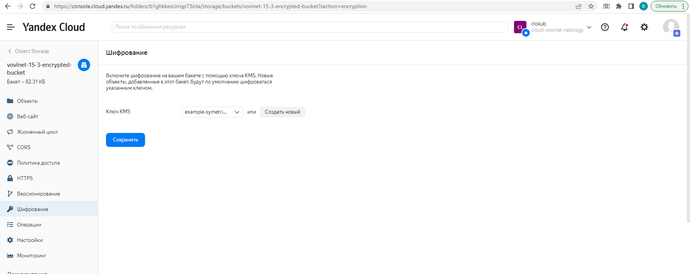
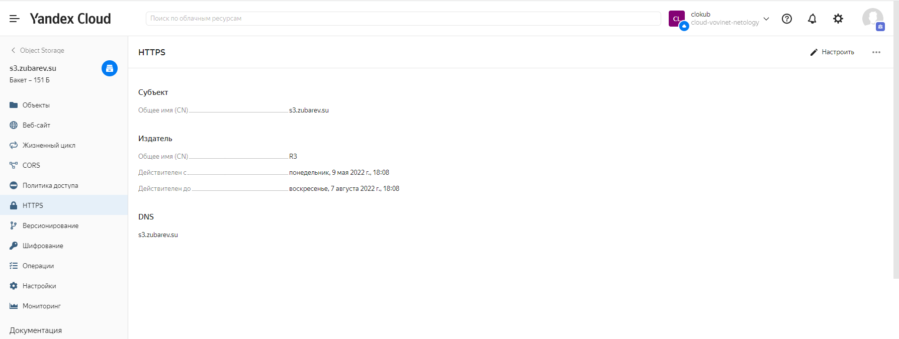
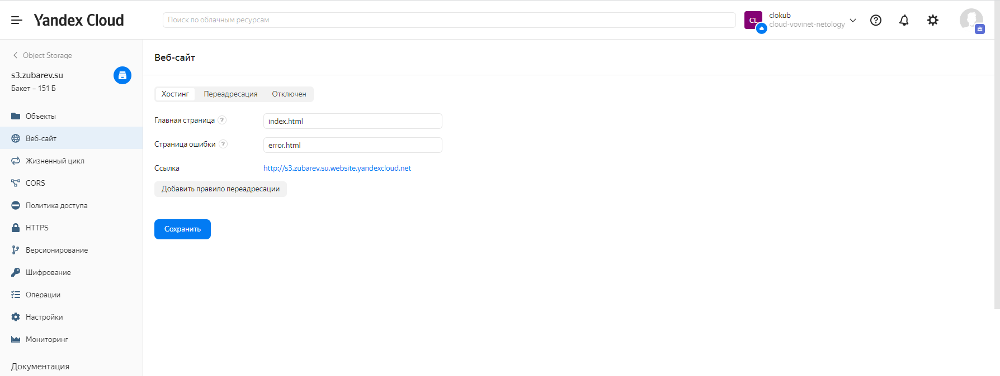
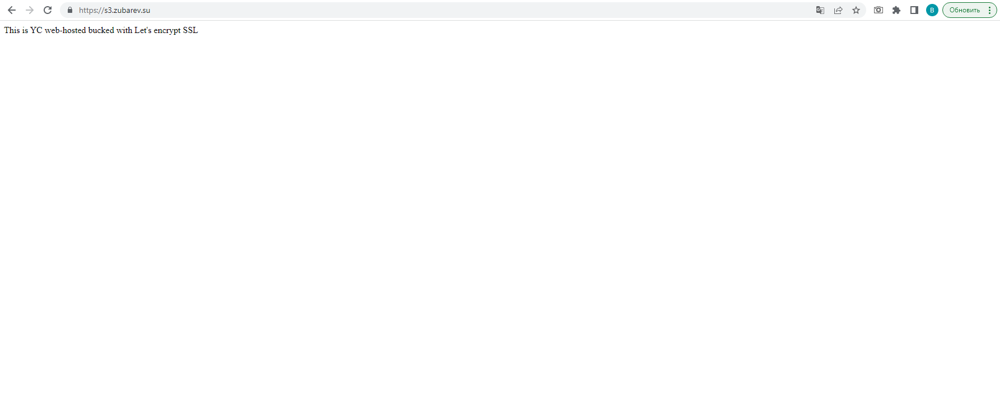

# 15.3 "Безопасность в облачных провайдерах"

## 1. Яндекс.Облако

### Зашифрованное облачное хранилище

Получились следующие [манифесты](15.3/terraform/)

```
$ terraform apply

Terraform used the selected providers to generate the following execution plan. Resource actions are indicated with the following symbols:
  + create

Terraform will perform the following actions:

  # yandex_iam_service_account.object-sa will be created
  + resource "yandex_iam_service_account" "object-sa" {
      + created_at = (known after apply)
      + folder_id  = "b1ghkkescirrqp73inla"
      + id         = (known after apply)
      + name       = "object-sa"
    }

  # yandex_iam_service_account_static_access_key.sa-static-key will be created
  + resource "yandex_iam_service_account_static_access_key" "sa-static-key" {
      + access_key           = (known after apply)
      + created_at           = (known after apply)
      + description          = "static access key for object storage"
      + encrypted_secret_key = (known after apply)
      + id                   = (known after apply)
      + key_fingerprint      = (known after apply)
      + secret_key           = (sensitive value)
      + service_account_id   = (known after apply)
    }

  # yandex_kms_symmetric_key.key-a will be created
  + resource "yandex_kms_symmetric_key" "key-a" {
      + created_at        = (known after apply)
      + default_algorithm = "AES_128"
      + description       = "description for key"
      + folder_id         = (known after apply)
      + id                = (known after apply)
      + name              = "example-symetric-key"
      + rotated_at        = (known after apply)
      + rotation_period   = "8760h"
      + status            = (known after apply)
    }

  # yandex_resourcemanager_folder_iam_member.sa-editor will be created
  + resource "yandex_resourcemanager_folder_iam_member" "sa-editor" {
      + folder_id = "b1ghkkescirrqp73inla"
      + id        = (known after apply)
      + member    = (known after apply)
      + role      = "storage.editor"
    }

  # yandex_storage_bucket.test will be created
  + resource "yandex_storage_bucket" "test" {
      + access_key         = (known after apply)
      + acl                = "private"
      + bucket             = "vovinet-15-3-encrypted-bucket"
      + bucket_domain_name = (known after apply)
      + force_destroy      = false
      + id                 = (known after apply)
      + secret_key         = (sensitive value)
      + website_domain     = (known after apply)
      + website_endpoint   = (known after apply)

      + server_side_encryption_configuration {
          + rule {
              + apply_server_side_encryption_by_default {
                  + kms_master_key_id = (known after apply)
                  + sse_algorithm     = "aws:kms"
                }
            }
        }

      + versioning {
          + enabled = (known after apply)
        }
    }

Plan: 5 to add, 0 to change, 0 to destroy.

Do you want to perform these actions?
  Terraform will perform the actions described above.
  Only 'yes' will be accepted to approve.

  Enter a value: yes

yandex_iam_service_account.object-sa: Creating...
yandex_kms_symmetric_key.key-a: Creating...
yandex_kms_symmetric_key.key-a: Creation complete after 1s [id=abjfarshi1darsar263d]
yandex_iam_service_account.object-sa: Creation complete after 1s [id=ajeka0uvobg14fh7bda6]
yandex_iam_service_account_static_access_key.sa-static-key: Creating...
yandex_resourcemanager_folder_iam_member.sa-editor: Creating...
yandex_iam_service_account_static_access_key.sa-static-key: Creation complete after 0s [id=ajeipkj4dp5b9h58uas2]
yandex_storage_bucket.test: Creating...
yandex_storage_bucket.test: Creation complete after 1s [id=vovinet-15-3-encrypted-bucket]
yandex_resourcemanager_folder_iam_member.sa-editor: Creation complete after 1s [id=b1ghkkescirrqp73inla/storage.editor/serviceAccount:ajeka0uvobg14fh7bda6]

Apply complete! Resources: 5 added, 0 changed, 0 destroyed.
```
В панели управления выглядит так, никаких явных признаков того, что бакет зашифрован не наблюдаю.  

  

### SSL-сертификат для объектного хранилища.

Максимально постарался произвести настройку с помощью terraform, хотя задание вроде бы этого не требовало. В итоге, что делалось руками:
- запрос сертификата и подтверждение владения доменом
- назначение сертификата на хранилище (в документации описано только как это делается через веб панель управления)
- создание CNAME-записи у регистратора домена

В итоге имеем следующее:

```
$ dig s3.zubarev.su

; <<>> DiG 9.16.1-Ubuntu <<>> s3.zubarev.su
;; global options: +cmd
;; Got answer:
;; ->>HEADER<<- opcode: QUERY, status: NOERROR, id: 39836
;; flags: qr rd ad; QUERY: 1, ANSWER: 3, AUTHORITY: 0, ADDITIONAL: 0
;; WARNING: recursion requested but not available

;; QUESTION SECTION:
;s3.zubarev.su.                 IN      A

;; ANSWER SECTION:
s3.zubarev.su.          0       IN      CNAME   s3.zubarev.su.website.yandexcloud.net.
s3.zubarev.su.website.yandexcloud.net. 0 IN CNAME website.yandexcloud.net.
website.yandexcloud.net. 0      IN      A       213.180.193.247

;; Query time: 50 msec
;; SERVER: 172.21.176.1#53(172.21.176.1)
;; WHEN: Mon May 09 19:54:18 EAT 2022
;; MSG SIZE  rcvd: 208
```

  

  

  

